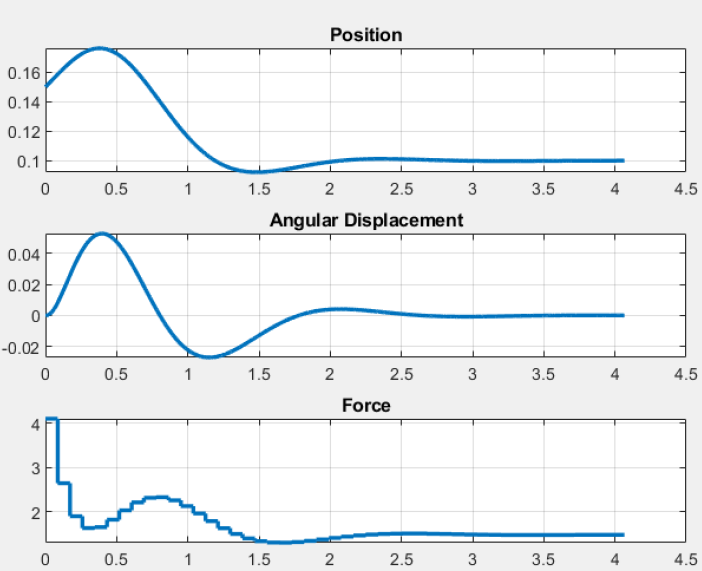

# LQ-Optimal-Control-for-ball-beam-problem

Code developed for "S. Sanchez, - Simulation and control of a 2D cutting machine in Matlab/Simulink ".  
Master's graduate "Calabria University".  
For any questions or suggestions write to sofysan.1993@gmail.com

# Sumary.
This repository contains a study of the "Ball and Beam" system, which involves a beam that can be tilted by a motor, allowing a ball to roll back and forth. The goal is to maintain the ball's position on the beam. MATLAB and Simulink were used for modeling, simulation, and control law design.
The work was divided into three phases: system modeling and analysis, regulation problem, and tracking problem. The system's equations, derived from physics, were used to analyze reachability, stability, observability, and detectability. A control law was developed to address both regulation and tracking problems, incorporating integral action to correct steady-state errors.

  

# Process  
1.  The projec starts finding the mamtematial description of the model.
2.	The dynamic system is linearized using a S-function and trim build-in function of Simulink.
3.	Study of Structural Properties. 
4.	Compute the Finite Time Horizon Linear Quadratic (LQ) Optimal Control for **"Regulation problem"**
5.	Compute the Finite Time Horizon Linear Quadratic (LQ) Optimal Control for **"Tracking problem"**

# Prerequisites
- The code was created and tested on the Matlab/Simulink 2023a environment

# File description
The repository contains three files
1. **Code**: This file contains all the necessary MATLAB/Simulink programs to run the project.
2. **Report_project_optimal**: This contains the explanation of the complete process, the mathematical formulations, and the control configuration.

# Example to run the experiment  
**"Ball and Beam"**
### Matlab/Simulink simulation 
1. Download the files. 
2.1 To perform the regulation problem run the Matlab file "**ball_beam_regulation**".
2.2 To perform the tracking problem run the Matlab file "**ball_beam_tracking**".
2.3 To perform the tracking problem with an integrator run the Matlab file "**ball_beam_track_with_integrator**".
3. The plots should start to show the results

  

